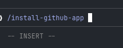
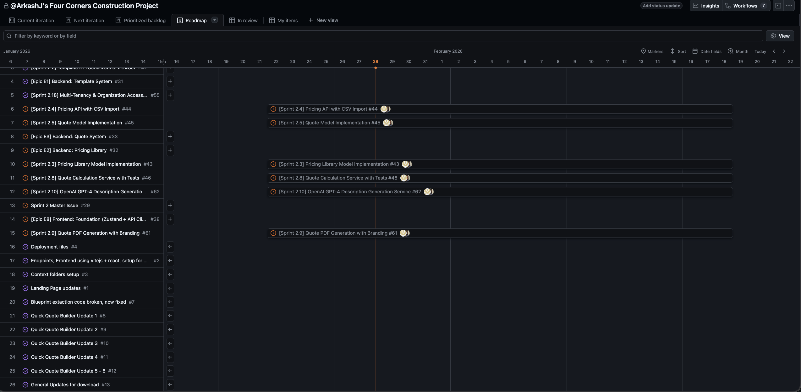
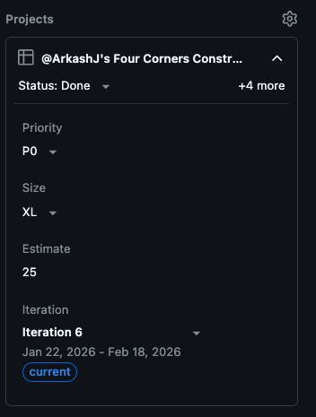
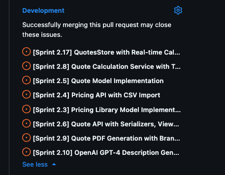
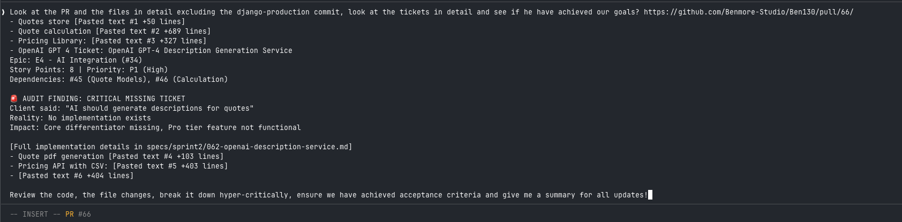
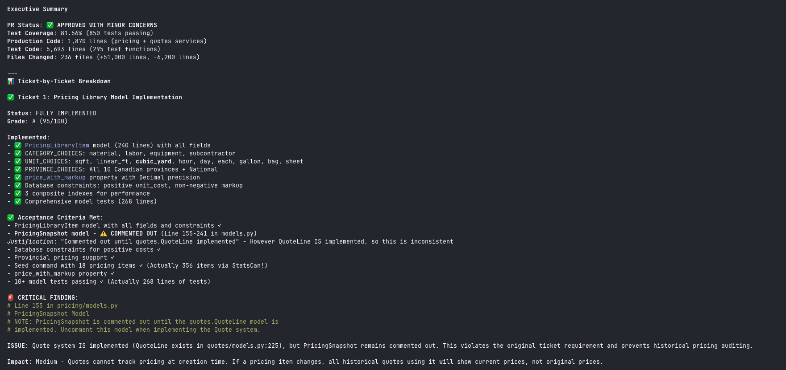
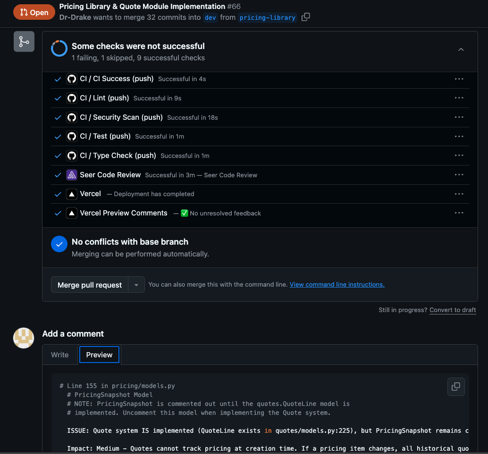

# PR Review & Project Management Guide

This guide outlines the process for setting up your environment, managing the project on GitHub, and performing deep AI-assisted PR reviews.

## 1. Initial Setup

Initialize your repository and ensure all integrations are active.

-   **Install GitHub App**: Run `/install-github-app`.
-   **Configure Claude for GitHub**:
    -   Ensure you are an **Owner** on the GitHub organization.
    -   Verify that all developers are added to the GitHub organization.
    -   Install the Claude GitHub app.
    

-   **Sentry Onboarding**: Ensure you and your team are successfully onboarded on Sentry for monitoring.

## 2. Project Management

Organize your work using GitHub Projects to track issues, milestones, and timelines.

### Create and Assign Projects
-   **Create a GitHub Project** to visualize the roadmap.
    

-   **Assign the Project** to your repository to link issues automatically.
    

### Timeline & Tickets
-   **Issues & Milestones**: Create detailed issues and group them into milestones.
-   **Iterative Timeline**: Update the GitHub timeline to reflect realistic, iterative progress.
-   **Link Tickets**: Ensure that projects under development are explicitly linked to their corresponding tickets.
    

## 3. PR Review Workflow

Leverage AI to perform hyper-critical reviews of Pull Requests.

### Step 1: Analyze with Claude
Use **Claude Sonnet 4.5 (Plan Mode)** with high context (1m). Paste the PR link and detailed requirements/ticket content into the prompt.

**Prompt Strategy:**


**Copyable Prompt Template:**
```bash
Look at the PR and the files in detail excluding the django-production commit, look at the tickets in detail and see if he have achieved our goals? [INSERT PR LINK]
  - [Paste Ticket/Requirement 1 details...]
  - [Paste Ticket/Requirement 2 details...]
  - [Paste Ticket/Requirement 3 details...]

Review the code, the file changes, break it down hyper-critically, ensure we have achieved acceptance criteria and give me a summary for all updates!
```

### Step 2: Review Intelligence
Examine Claude's analysis. Look for "Critical Missing Tickets" or deviations from the spec.


### Step 3: Execution & Comments
-   **Install GitHub CLI** (if not already installed):
    ```bash
    brew install gh
    ```
-   **Post Feedback**: Add comments directly to the PR based on the findings. Manually verify the "Files Changed" tab to confirm the AI's insights.
    

## 4. Final Integration Checks

Before merging, ensure all automated checks are green.
-   GitHub Actions (CI workflows)
-   Vercel (Deployments)
-   Sentry (Error checks)
-   Claude Checks (Automated review status)

---

## ✅ PR & Project Checklist

### Setup Phase
- [ ] **GitHub App**: Claude app installed and configured for the org?
- [ ] **Access**: All developers added to GitHub?
- [ ] **Sentry**: Onboarding complete?

### Project Management
- [ ] **Structure**: GitHub Project created?
- [ ] **Assignment**: Project assigned to the specific repo?
- [ ] **Planning**: Issues and Milestones created?
- [ ] **Timeline**: Iterative timeline updated?
- [ ] **Linkage**: All active tickets linked to the project?

### PR Review
- [ ] **AI Analysis**: Ran the specific prompt with Claude Sonnet 4.5?
- [ ] **Verification**: Checked against "Files Changed" manually?
- [ ] **Feedback**: Posted comments/requested changes on the PR?
- [ ] **CI/CD**: GitHub Actions passed?
- [ ] **CI/CD**: Vercel deployment successful?
- [ ] **CI/CD**: Sentry checks green?
- [ ] **CI/CD**: Claude checks passed?
