# Developer Workflow & Meeting Notes Processing

## 📋 Overview

This guide walks developers through the process of:
1. Accessing client meeting transcripts from the portal
2. Extracting technical requirements from meetings
3. Building detailed implementation action plans
4. Creating technical specifications and flow diagrams

---

## 🚀 Step-by-Step Workflow

### Step 1: Access the Client Portal

Navigate to the client portal and retrieve the meeting transcript.

**Instructions:**
- Go to: `https://client.benmore.tech`
- Login with your credentials
- Navigate to the **Transcripts** section
- Find and select the **most recent transcript**
- Review the meeting notes

---

### Step 2: Extract Technical Requirements with AI

Use Google's Gemini to process the meeting content and identify technical requirements.

**Instructions:**
1. Copy the entire transcript or relevant portions
2. Open **Gemini** (Google's AI model)
3. Paste the following prompt:

```
Read this meeting transcript and extract the technical requirements 
as a software developer. For each requirement, explain:
- What needs to be built/fixed
- The technical component involved
- Why it's important for the product

Be specific, technical, and actionable.

[PASTE TRANSCRIPT HERE]

 SUMMARIZE KEY ACTION PLANS from a technical perspective, I gave you bullet points, use subagents and build me a  very detailed technical plan with files to modify and bullet pointed lists along with key snippets from the transcripts

```
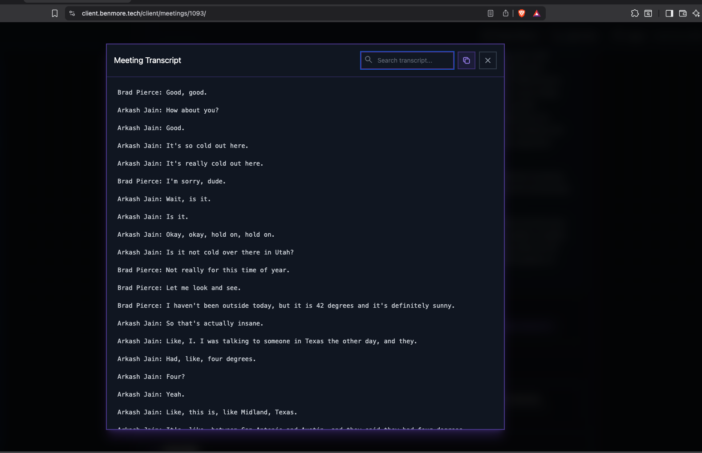


*Example*

  navigate to the most recent transcript and view it, open up Gemini 3 and give it an explanation of what you talked
  about in the meeting from a technical perspective. So for me it was:
  "1. Make sure you can generate QR codes per company and track them when activated, add tags when tracking to see
  what company go what codes
  2. In financials, get breakdown of redemption for company
  3. Be able to add zipcodes per service as well
  4. Ensure that navigation works and we persist the current page because right now when you hit the back arrow it
  takes you back to the dashboard in the landing page
  5. We need to finish the financial portion given the frontend
  6. when you click the HSP logo it takes you to the landing page, that should not happen
  7. ensure we can export a CSV for customers as well
  8. remove system stats from the client dashboard"

  [PASTE TRANSCRIPT]


3. Review Gemini's analysis and save the output
**gemini image**
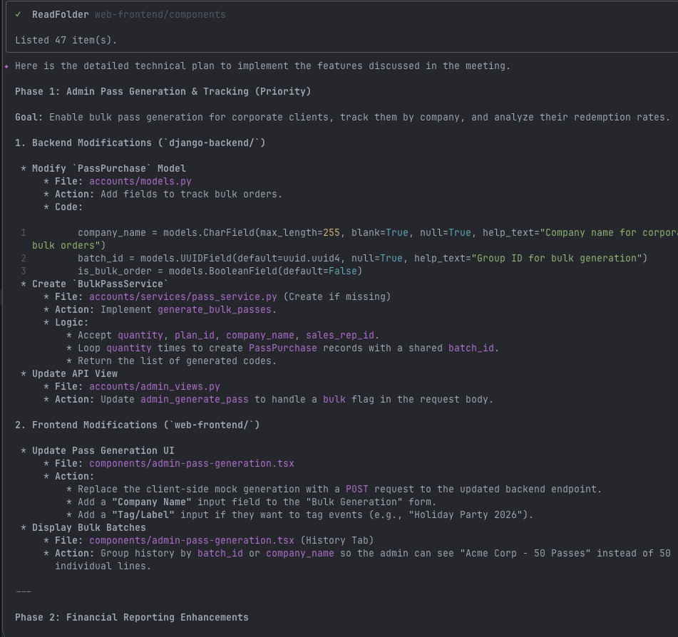

---

### Step 3: Build Implementation Action Plans with Claude

Verify your development environment is fully operational before planning.

**Instructions:**

1. **Activate Environment & Verify Setup**
   - Activate your virtual environment
   - Start both frontend and backend servers
   - Confirm both are running successfully:

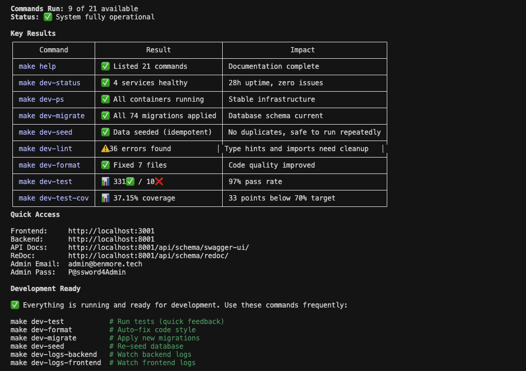

2. **Generate Implementation Plan**
   - Open Claude Code and switch to **Opus 4.5** with plan mode enabled
   - Provide Gemini's technical requirements to Claude
   - Request a detailed action plan including:
     - Fine-grained ASCII flow diagrams
     - API endpoint specifications
     - Database schema changes (if needed)
   - Allow Claude to complete the plan analysis, then stop the session

3. **Access and Review Plan**
   - Run: `code ~/.claude` (or open in your editor)
   - Navigate to the `plans/` directory
   - Review the generated plan structure

4. **Execute Plan with Skills & Superpowers**
   - Copy plan to your project: `rsync -avz ~/.claude/plans/[PLAN_NAME] [YOUR_LOCATION]`
   - Switch to **Sonnet 4.5** for execution
   - Leverage Claude Code superpowers:

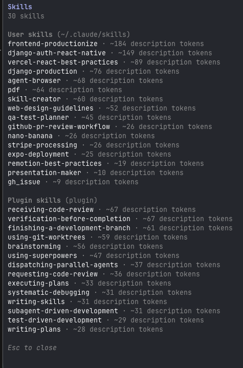

   - Use `superpowers:brainstorming` for design decisions
   - Use `superpowers:writing-plans` for structured implementation
   - Use `superpowers:test-driven-development` for test coverage
   - Use `agent-browser` to navigate and test the application during development


### Example prompt

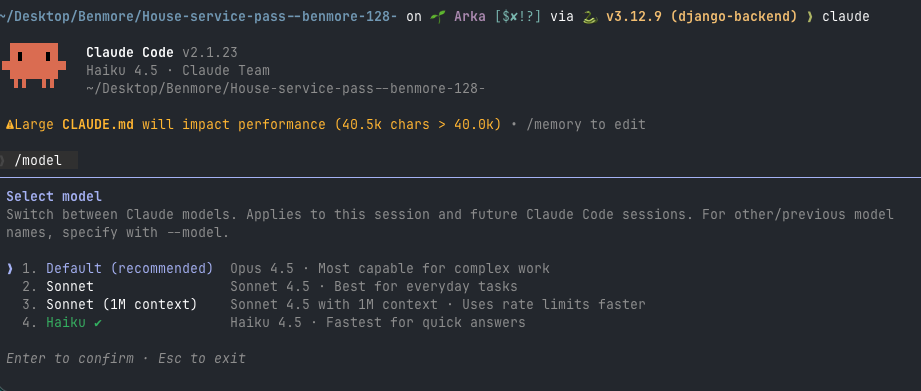

Paste the gemini result and the transcript (again) here.
```bash
Pasted text #1 +142 lines] I want a detailed action plan including:
       - Fine-grained ASCII flow diagrams
       - API endpoint specifications
       - Database schema changes (if needed)
  Read the CLAUDE.md, understand the todos, here is the transcript: [Pasted text #2 +1484 lines]

  Generate a detailed plan with the necessary skills you need to evoke in the plan. Here is the list of skills, you
  need to break everything down into subplans, use double shot latte to keep running, have acceptance criteria,
  detailed plans with business and technical plans, have within the plan information to copy nuances into the
  CLAUDE.md, add docs in the API endpoints and add tests, use subagents, the plan should have these prompts after
  each feature is done.
```

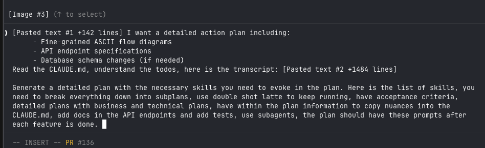
#### Hit shift+tab to switch to plan mode. **Ensure you have taken a screenshot of skills which you can install from skills.sh and /plugins**

#### Once done you might have to prompt claude during plan mode 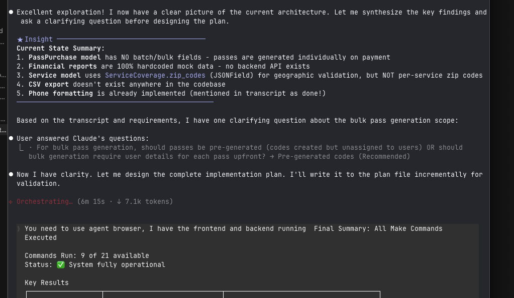

```bash
npm install -g agent-browser
agent-browser install  # Download Chromium
```

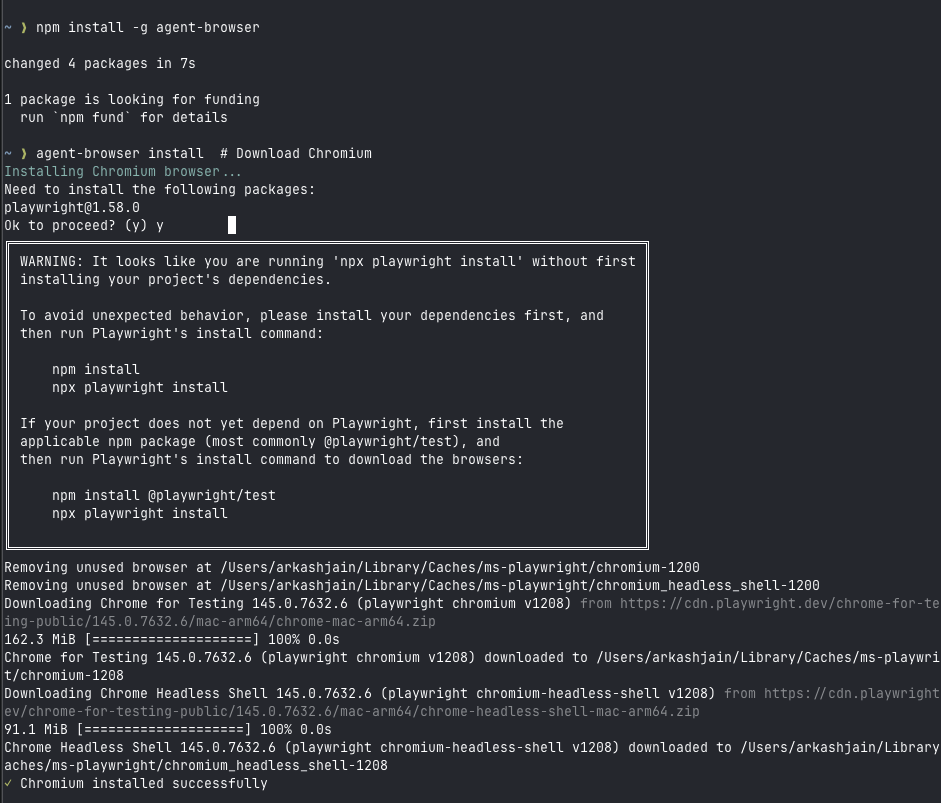


### Copy Plan 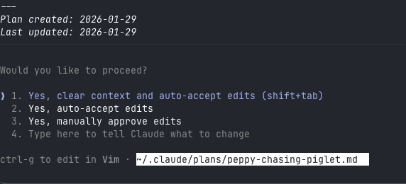 and run it 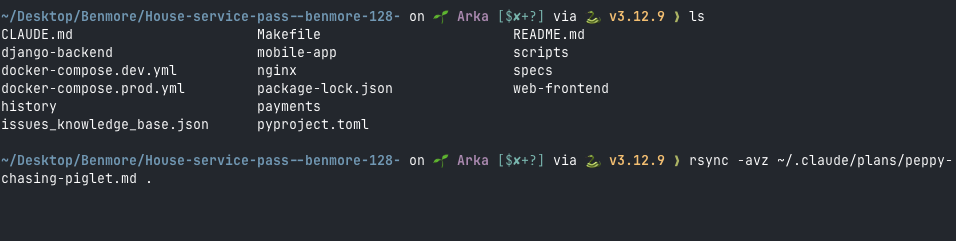

## Navigating Claude Code
### Approve Plan and use superpowers execute plan with custom prompt
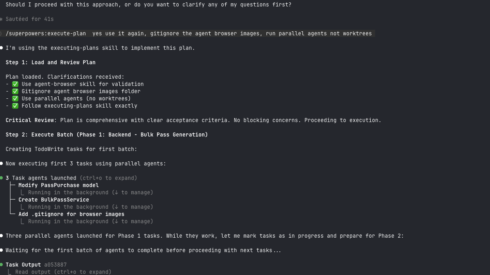

### Keep telling it to document changes 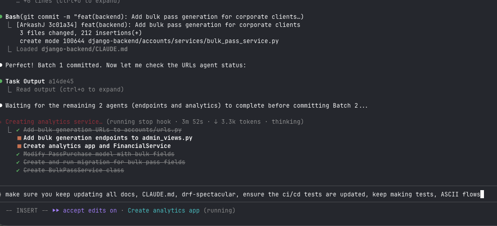

### Run Multiple Agents 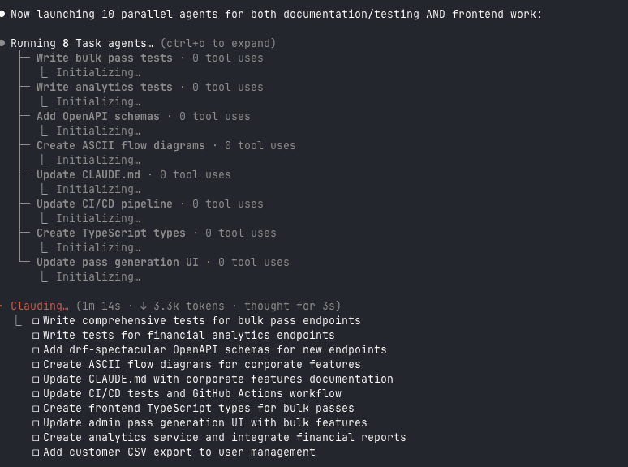

---
## 🔗 Related Guides

- [PR Review Workflow](./01-pr-review-workflow.md) - For code review process
- [Dev Toolkit](../toolkit/) - Development environment setup

---

