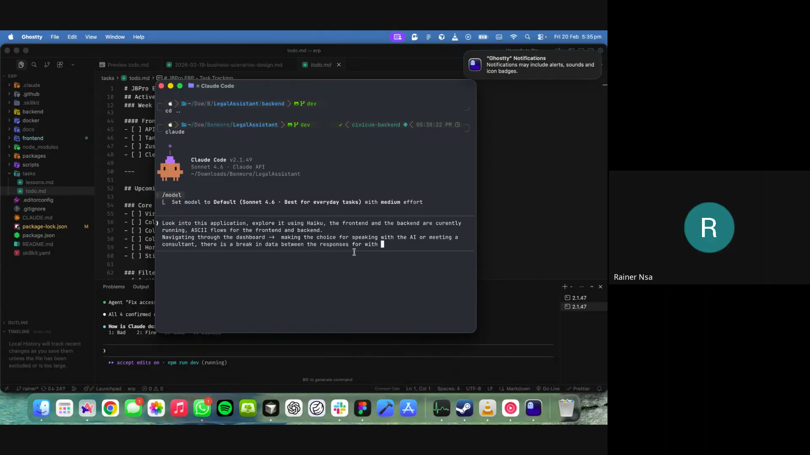
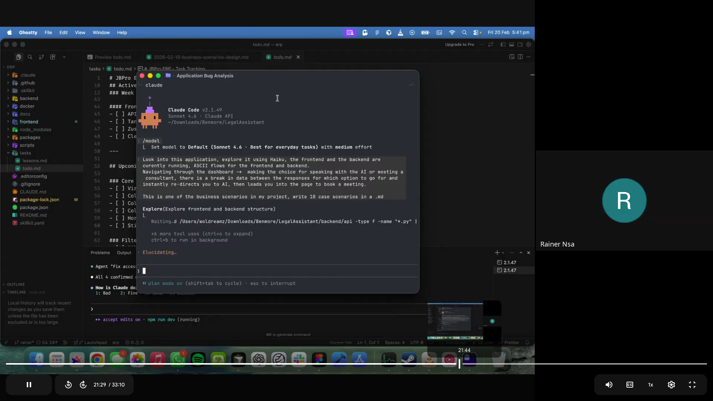
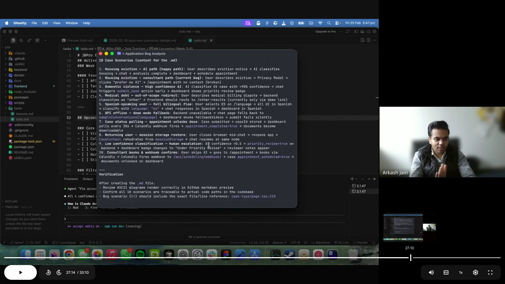
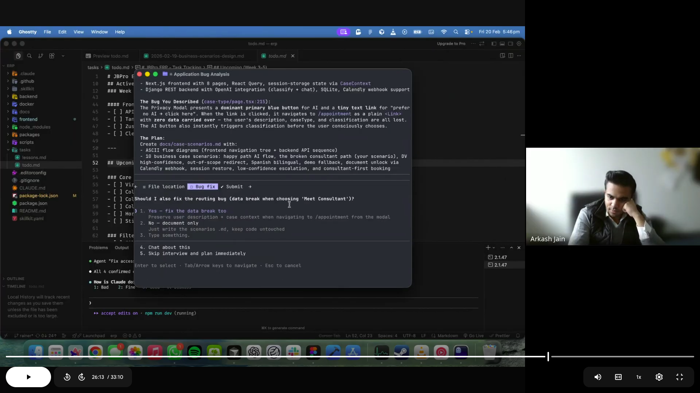
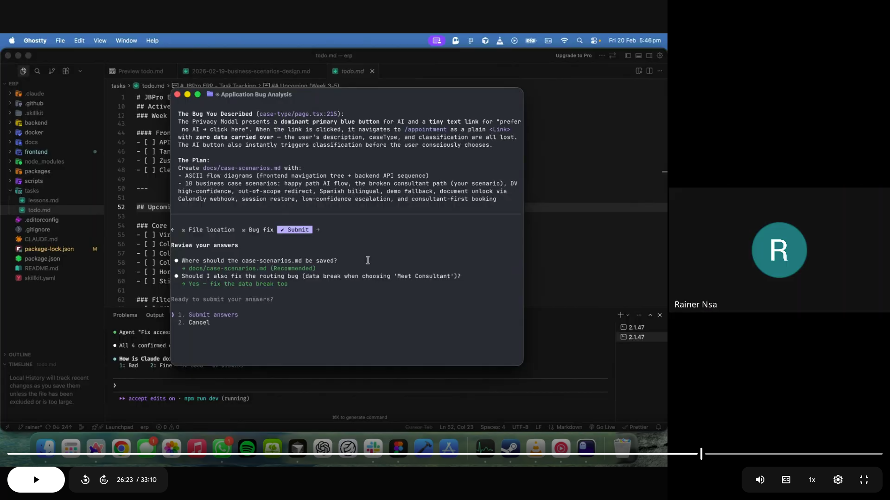
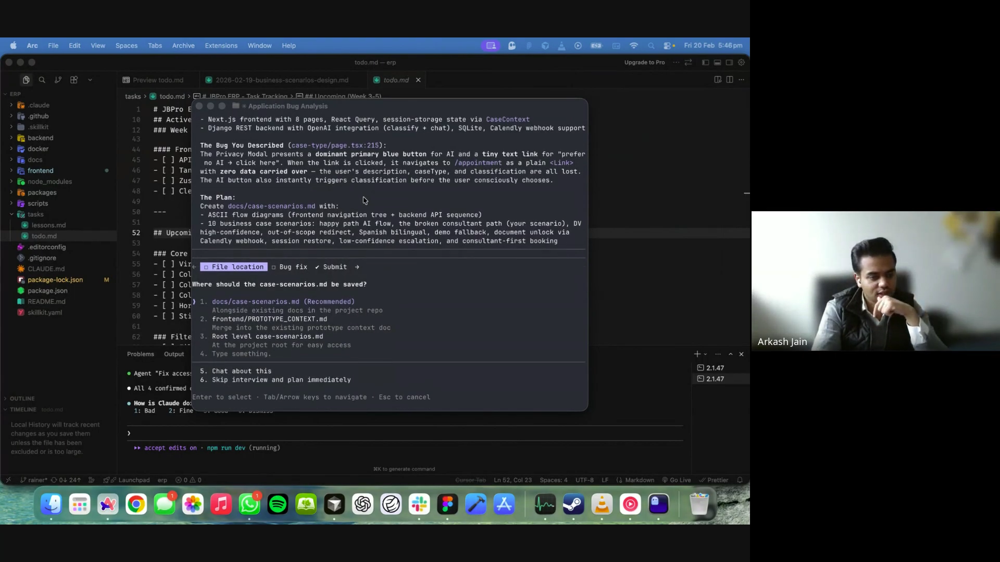

# Wiki: Formalizing Complex Business Scenarios for Testing

> **Author:** Rainer Nsa
> **Reviewed by:** Arkash Jain
> **Date:** 2026-02-20
> **Project:** Civicum Legal Assistant

---

## Overview

This wiki documents the engineering methodology introduced during the Civicum Legal Assistant onboarding session. The technique — **scenario-driven development** — formalizes complex, multi-step user journeys into structured business scenarios, then converts them into integration tests that guide both testing and implementation.

The approach is adapted from test-driven development (TDD) but starts one level higher: at the **business scenario** level, before any test or code is written.

---

## The Technique: Scenario-Driven Development

### Core Principle

> "You start by brainstorming complex business scenarios. Each scenario becomes a full integration test. The tests then tell you what code to write or update."
> — Arkash Jain

Rather than writing unit tests for individual functions, this method maps out the **entire user journey** — including failures, edge cases, and system integrations — and uses those as the source of truth for what the application must do.

### Why It Works

| Traditional TDD | Scenario-Driven |
|----------------|-----------------|
| Write test → write code | Brainstorm scenario → write test → write code |
| Unit-level granularity | Journey-level granularity |
| Tests individual functions | Tests full user flows end-to-end |
| Misses integration gaps | Surfaces gaps between systems |
| Developer-focused | Business + developer aligned |

---

## Step-by-Step Process

### Step 1 — Run the Application

Before writing anything, get the full stack running locally so the AI has live context to explore.

```bash
# Backend (Django + UV)
cd backend
source .venv/bin/activate
python3 manage.py migrate
python3 manage.py runserver

# Frontend (Next.js)
cd frontend
npm run build   # verify it compiles
npm start
```


*Claude Code receiving the task: explore the running application, generate ASCII flows, document the AI/consultant routing bug*

---

### Step 2 — Generate ASCII Flows with AI

With the application running, instruct the AI (Claude Sonnet 4.6) to explore the codebase and generate ASCII flow diagrams for:
- All frontend page navigation paths
- All backend API endpoints and their data flow

**Prompt pattern used:**
```
The frontend and backend of the application are currently running.
Explore the legal assistant application using sub-agents (Haiku for speed).
Generate ASCII flows for:
1. Frontend navigation — all page transitions and user choices
2. Backend API — all endpoints, request/response shapes, and DB interactions
Focus on major user flows. Use Haiku sub-agents for exploration.
```


*Claude Code in Plan Mode exploring the frontend and backend simultaneously with Haiku sub-agents*

The resulting flows expose **exactly where data is passed, where it's dropped, and where integrations are missing** — before writing a single test.

---

### Step 3 — Brainstorm Business Scenarios

With the flows in hand, use the AI in **Plan Mode with Opus** to brainstorm 8–10 business scenarios. Each scenario must be:

- **Multi-step** — covers more than one page or API call
- **Realistic** — based on actual user types and legal situations
- **Complete** — includes the expected outcome AND any known gaps

**Prompt pattern used:**
```
The frontend and backend ASCII flows are above.
Now brainstorm 10 complex, multi-step business scenarios.
Each should cover a distinct user journey: different user types,
different legal case types, failure modes, bilingual paths, and
integration edge cases. Use Opus for brainstorming, Sonnet for writing.
Write the scenarios to docs/case-scenarios.md.
```


*Claude Code output showing all 10 business case scenarios written to the docs folder*

**Scenario template:**

```markdown
### Scenario N — [Title]

**User:** [Who is this person and what is their situation?]

**Flow:**
1. [Page or API step]
2. [Next step with specific data]
3. ...

**Expected outcome:** [What should happen if everything works]
**Gaps identified:** [What is missing or broken in the current implementation]
```

---

### Step 4 — Review Scenarios as a Team

The scenarios are not just test specs — they are a **shared language** between engineering, product, and legal domain experts.

In the Civicum session, the scenarios surfaced these gaps immediately:

| Gap | Discovered in Scenario |
|-----|------------------------|
| No-AI path drops user description | Scenario 2 |
| Calendly webhook is a stub | Scenarios 7 & 10 |
| Documents always locked | Scenario 7 |
| `other` classification has no auto-route | Scenario 4 |
| No `caseId` on consultant-only path | Scenario 10 |


*Claude Code identifying the data break: the "Prefer no AI?" path navigated to /appointment without preserving the user's description in CaseContext*


*Claude Code confirming: where to save the file, and whether to fix the routing bug alongside the documentation*

---

### Step 5 — Convert Scenarios to Integration Tests

Each scenario becomes one integration test. The test:
- Sets up the required state (user language, description, mock API responses)
- Walks through every step in the flow
- Asserts the expected outcome at each decision point

**Example test structure (pseudocode):**

```python
# Scenario 1: Housing Eviction — AI Path (Happy Path)
def test_housing_eviction_ai_path():
    # Step 1: Language selection
    browser.navigate("/language")
    browser.click("English")

    # Step 2: Case description
    browser.navigate("/case-type")
    browser.fill("description", "My landlord gave me a 5-day eviction notice")
    browser.click("send")

    # Step 3: Privacy Modal — choose AI
    modal = browser.find_modal("Privacy Disclosure")
    mock_api("POST /api/chat/classify/", {
        "classification": "housing",
        "confidence": 0.94
    })
    modal.click("Continue to Plan →")

    # Step 4–7: Chat flow
    assert browser.current_url == "/chat"

    # Step 8: Case submission
    mock_api("POST /api/cases/submit/", {"case_id": 42, "ai_confidence": 0.94})
    browser.find("Analysis Complete").click("View Your Legal Plan")

    # Step 9: Dashboard
    assert browser.current_url == "/dashboard"
    assert browser.find("Confidence Score").text == "94%"
    assert browser.find("Locked").exists()  # docs locked pre-appointment
```

---

### Step 6 — Write or Update Code to Pass Tests

Once the integration tests are defined:
1. Run tests against the current codebase — they fail where gaps exist
2. Fix the simplest gaps first (e.g., the data-break bug in Scenario 2)
3. Implement stubs (e.g., Calendly webhook) to pass more complex tests
4. Iterate until all scenarios pass

---

## Tools & Setup Used in This Session

### Claude Code Configuration

| Tool | Purpose |
|------|---------|
| Claude Sonnet 4.6 | Primary coding assistant (medium effort) |
| Claude Opus | Brainstorming and plan writing |
| Claude Haiku | Sub-agent exploration (fast, cheap) |
| Plan Mode | Multi-step planning before touching code |

### Plugins Installed

```bash
# Python Language Server Protocol (type checking, code intelligence)
claude mcp add python-lsp

# Code Simplifier (refactoring suggestions)
claude mcp add code-simplifier
```

**Why LSPs matter:**
> Language Server Protocols restrict Claude's thinking space — the AI can only suggest code that passes type checking and adheres to project conventions. This means tests are more likely to pass CI/CD on the first attempt.
> — Arkash Jain


*The implementation plan showing the bug fix task alongside the documentation tasks*

---

### Project Navigation Commands

```bash
# View project structure (ignoring node_modules)
tree -I "node_modules|.venv|__pycache__" --dirsfirst

# Start backend
cd backend && source .venv/bin/activate
python3 manage.py migrate && python3 manage.py runserver

# Start frontend
cd frontend && npm start
```


*The full task as given to Claude Code at the start of the session*

---

## Scenario Matrix

Use this matrix to track coverage. Each cell should eventually map to a passing integration test.

| Scenario | User Type | Case Type | Path | Language | Status |
|----------|-----------|-----------|------|----------|--------|
| 1 | Tenant | Housing | AI | EN | Documented |
| 2 | Tenant | Housing | Consultant | EN | Bug Fixed |
| 3 | DV Survivor | Domestic Violence | AI | ES | Documented |
| 4 | Debtor | Medical/Other | Out-of-scope | EN | Gap Identified |
| 5 | Monolingual | Housing | AI | ES | Documented |
| 6 | Any | Any | Demo/Offline | EN/ES | Documented |
| 7 | Existing Case | Housing | Webhook | EN | Gap Identified |
| 8 | Returning | Any | Session Restore | EN/ES | Documented |
| 9 | Ambiguous | Unknown | Escalation | EN | Documented |
| 10 | Consultant-only | Housing | Webhook | EN | Gap Identified |

---

## Key Takeaways

1. **Scenarios before tests, tests before code** — Always understand the full journey before writing implementation.

2. **ASCII flows are the shared blueprint** — They give every team member (engineers, advocates, product) the same mental model of the system.

3. **Gaps are features, not failures** — When a scenario exposes a gap, that gap becomes a ticket. The scenario is still valuable even if the code doesn't exist yet.

4. **Language matters at every layer** — Bilingual scenarios (EN/ES) must be tracked explicitly because translation bugs often only surface at integration level, not unit level.

5. **AI-assisted scenario generation scales** — Using Claude to explore the running app and generate scenarios took minutes instead of days. The AI surfaces edge cases a human might miss on a first pass.

---

## Related Files

- [`development/07-case-scenarios-civicum.md`](./07-case-scenarios-civicum.md) — The 10 scenarios + ASCII flows generated in this session

---

## Next Steps

- [ ] Add screenshot captures from session recording to the placeholders above
- [ ] Convert each scenario to a concrete integration test in `backend/tests/` and `frontend/tests/`
- [ ] Implement Calendly webhook handler (Scenarios 7 & 10)
- [ ] Implement auto-route for `other` classification (Scenario 4)
- [ ] Associate `caseId` with consultant-only booking path (Scenario 10)
