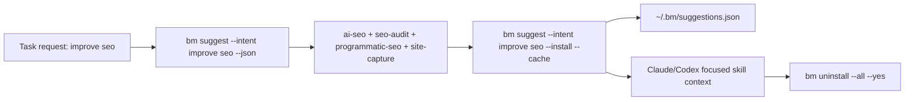
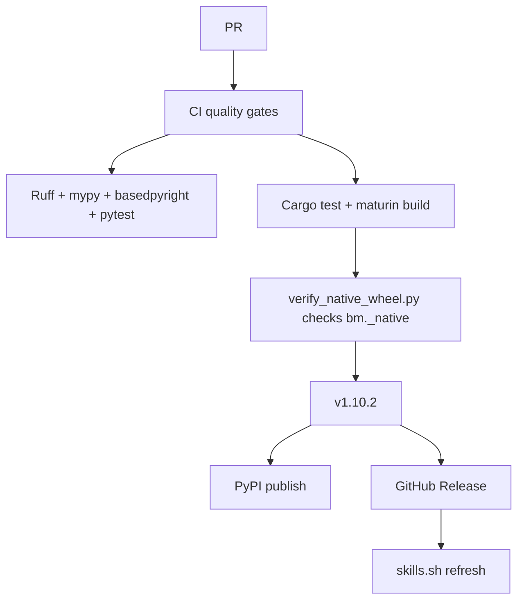

# bm v1.10.2 Release Audit

This document maps the requested public-release requirements to concrete evidence in
the repository and current release branch. It also includes copy-ready PR text and
PR comments for GitHub review.

## Requirement Matrix

| Requirement | Evidence | Status |
|---|---|---|
| Code of Conduct | `CODE_OF_CONDUCT.md` | Complete |
| Public MIT license with credit | `LICENSE`, `AUTHORS.md`, `NOTICE` credit Arkash Jain and Benmore Studio | Complete |
| Security/compliance posture | `SECURITY.md`, `skills.sh.json`, README security skill list | Complete |
| Package for PyPI/CLI installs | `bm/pyproject.toml`, `bm/uv.lock`, release workflow, `uv build --sdist` verification | Complete |
| skills.sh readiness | `skills.sh.json`, README badge, all grouped skills verified to exist | Complete |
| Easy unlink/uninstall | `bm uninstall [names...]`, `bm uninstall --all --yes`, CLI tests | Complete |
| Hook install/remove/status | `bm hooks install`, `bm hooks remove`, `bm hooks status`, README/using-bm docs | Complete |
| Agent-friendly task suggestions | `bm suggest --intent <task>`, `--install`, `--cache`, `--json`, `--dry-run` | Complete |
| SEO example | `bm suggest --intent "improve seo" --top 4 --json` returns `ai-seo`, `seo-audit`, `programmatic-seo`, `site-capture` | Complete |
| Context cleanup | `bm uninstall --all --yes` and `~/.bm/suggestions.json` cache flow documented/tested | Complete |
| Rust pipeline | `bm/native`, `cargo test`, `maturin build`, `scripts/verify_native_wheel.py`, CI release jobs | Complete |
| JSON stdout contracts | `bm/tests/test_cli_contracts.py`, JSON smoke commands | Complete |
| Mermaid flows | `README.md`, `docs/RELEASE_HARDENING.md` | Complete |
| Version/changelog/tag | `CHANGELOG.md`, `bm/bm/__init__.py`, `bm/pyproject.toml`, tags `v1.10.0`, `v1.10.1`, `v1.10.2` | Complete |
| Actual GitHub PR/comments | Branch pushed; PR creation blocked by local GitHub auth | External blocker |

## Current Remote State

- Branch: `codex-bm-v110-release-hardening`
- Latest release tag: `v1.10.2`
- PR URL: `https://github.com/Benmore-Studio/Benmore-Meridian/pull/new/codex-bm-v110-release-hardening`

## Verification Commands

```bash
uv run ruff format --check bm/ tests/
uv run ruff check bm/ tests/
uv run mypy bm/
uv run --extra dev basedpyright
uv run pytest tests/ -q
uv run pytest tests/test_benmore_client.py -q
cargo test --manifest-path native/Cargo.toml
uv build --sdist
uv run --extra dev maturin build --release --out dist
uv run python scripts/verify_native_wheel.py dist/*.whl
bm suggest --intent "improve seo" --top 4 --json
```

## Copy-Ready PR Body

````markdown
## Summary

Prepare `bm` for public release as `v1.10.2`.

This PR adds the public compliance files, skills.sh configuration, package metadata,
task-intent skill suggestions, reversible install/uninstall flows, global context
output, Rust/PyO3 native wheel verification, and release documentation needed for a
public CLI release.

## Why This Shape

- Agents can ask from task intent, e.g. `bm suggest --intent "improve seo" --top 4 --install --cache`.
- The SEO intent flow returns `ai-seo`, `seo-audit`, `programmatic-seo`, and `site-capture`.
- Suggested skills can be installed for the session, cached in `~/.bm/suggestions.json`, then removed with `bm uninstall --all --yes`.
- `bm context --global --json` gives Codex/Claude full catalog awareness without loading every skill into active context.
- Release CI proves the native Rust extension is actually packaged in wheels.

## Flow



## Release Pipeline



## Verification

- `uv run ruff format --check bm/ tests/`
- `uv run ruff check bm/ tests/`
- `uv run mypy bm/`
- `uv run --extra dev basedpyright`
- `uv run pytest tests/ -q` — 94 passed
- `uv run pytest tests/test_benmore_client.py -q` — 171 passed
- `cargo test --manifest-path native/Cargo.toml`
- `uv build --sdist`
- `uv run --extra dev maturin build --release --out dist`
- `uv run python scripts/verify_native_wheel.py dist/*.whl`
- `bm suggest --intent "improve seo" --top 4 --json`
````

## Copy-Ready PR Comments

### Release Readiness Comment

````markdown
Release readiness is documented in `docs/RELEASE_AUDIT.md` and
`docs/RELEASE_HARDENING.md`.

The important verification point is that this release does not just run `maturin`;
CI also runs `scripts/verify_native_wheel.py dist/*.whl`, which fails unless the
wheel contains `bm._native`.
````

### Agent Workflow Comment

````markdown
The intended Claude/Codex workflow is:

```bash
bm suggest --intent "improve seo" --top 4 --install --cache
# run focused skills
bm uninstall --all --yes
```

This installs only the relevant skills, caches the recommendation set in
`~/.bm/suggestions.json`, and keeps the active Claude skills directory uncluttered.
````

### skills.sh Comment

````markdown
`skills.sh.json` groups the public catalog for skills.sh. The README badge points to
`https://skills.sh/Benmore-Studio/Benmore-Meridian`. After this branch is reachable
from the default branch or tag telemetry, skills.sh can index the grouped catalog.
````
