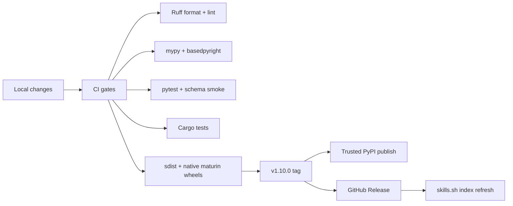
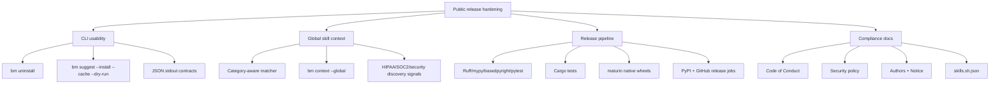
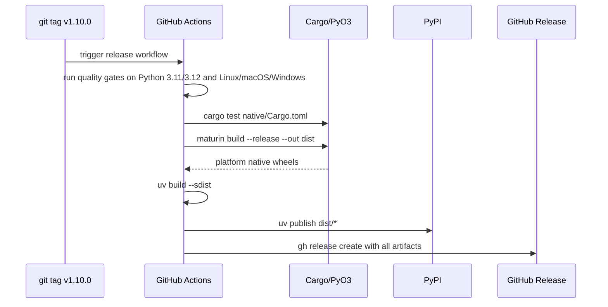

# bm v1.10.0 Release Hardening

This note summarizes the public-release split for `bm` and is intended to be copied into
PR descriptions or review comments.

## Release Flow

## PR Split

## Native Wheel Pipeline

## Reviewer Checklist

- CLI commands remain backward compatible.
- `--json` commands emit machine-readable JSON only on stdout.
- New warning/error text goes to stderr or Rich output only.
- `bm uninstall` only removes bm-managed installs and preserves external skills.
- `bm context --global` exposes the full skill catalog without installing everything.
- Security/compliance skills are discoverable from HIPAA, SOC 2, PHI, audit, MFA, auth, and tenant-isolation project signals.
- Release tags build an sdist and native wheels before publishing.
